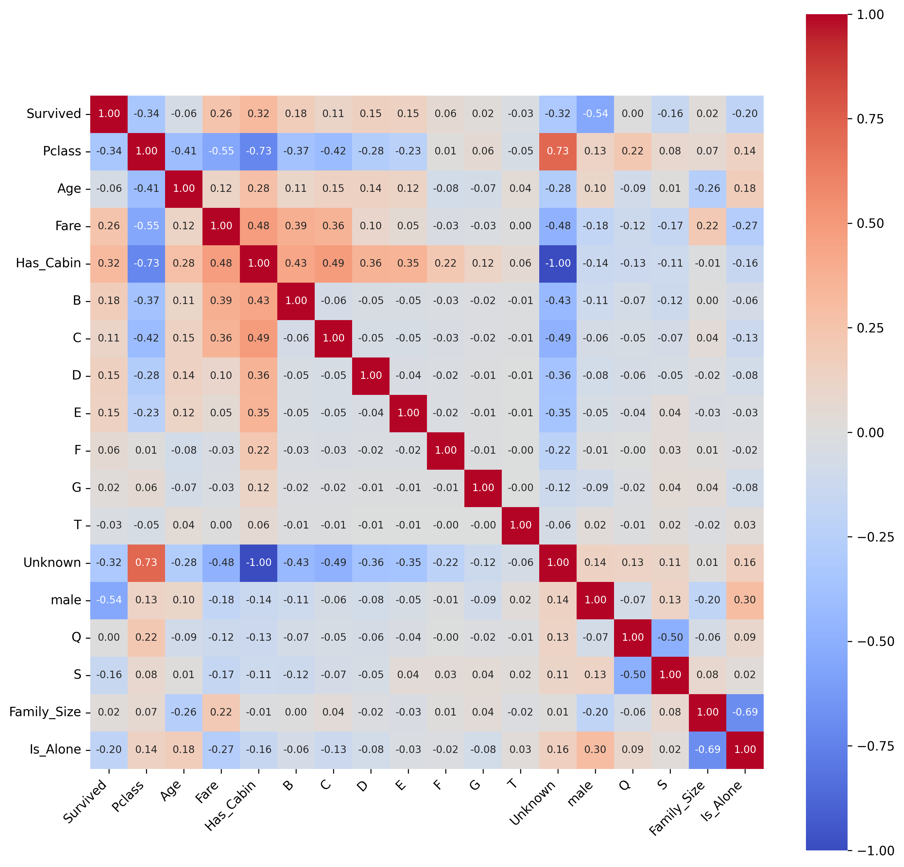
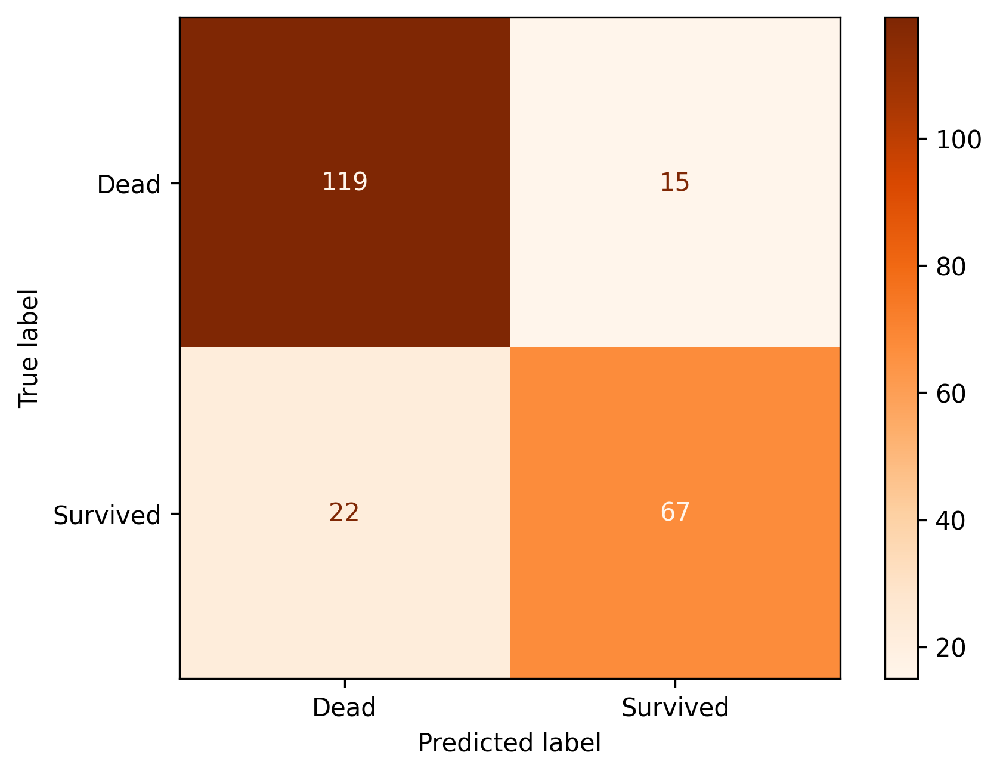

## 📌 Objective

- Predict passenger survival on the Titanic using Logistic Regression
- Apply a complete supervised classification pipeline on a real-world dataset
- Handle missing values and encode categorical features properly
- Evaluate model performance using standard classification metrics
- Visualize data patterns and model results

---

## 📊 Dataset

- Dataset: [Titanic – Machine Learning from Disaster (Kaggle)](https://www.kaggle.com/competitions/titanic)
- Target variable: `Survived` (0 = No, 1 = Yes)

### Features:

- `Pclass` — ticket class (1st, 2nd, 3rd)
- `Sex` — gender
- `Age` — age in years
- `SibSp` — number of siblings / spouses aboard
- `Parch` — number of parents / children aboard
- `Fare` — passenger fare
- `Embarked` — port of embarkation (C, Q, S)

---

## ⚙️ Data Preprocessing

- Missing values in `Age` handled using **median imputation**
- Missing values in `Embarked` filled with the **mode**
- `Cabin` column dropped due to excessive missing values
- Categorical features (`Sex`, `Embarked`) encoded using **label encoding / one-hot encoding**
- Irrelevant columns (`Name`, `Ticket`, `PassengerId`) removed

---

## 📈 Exploratory Data Analysis (EDA)

- Dataset overview using `info()` and `describe()`
- Survival rate analysis by gender, class, and age group
- Missing value analysis
- Correlation heatmap visualization

📌 Correlation Heatmap:

---

## 🤖 Model

### 🔹 Logistic Regression

- Input: `Pclass`, `Sex`, `Age`, `SibSp`, `Parch`, `Fare`, `Embarked`
- Target: `Survived`
- Train / Test split: 80% / 20%

📌 Confusion Matrix:

---

## 📏 Evaluation Metrics

The model was evaluated using:

- **Accuracy**
- **Precision**
- **Recall**
- **F1-Score**
- **Confusion Matrix**

---

## 📊 Results

| Metric        | Class 0 (Not Survived) | Class 1 (Survived) | Weighted Avg |
|---------------|------------------------|--------------------|--------------|
| Precision     | 0.84                   | 0.82               | 0.83         |
| Recall        | 0.89                   | 0.75               | 0.83         |
| F1-Score      | 0.87                   | 0.78               | 0.83         |
| **Accuracy**  |                        |                    | **83.41%**   |
| **ROC-AUC**   |                        |                    | **0.8809**   |

---

## 🧠 Key Insights

- Gender is the strongest single predictor of survival (`female` → higher survival rate)
- Passenger class (`Pclass`) strongly correlates with survival outcome
- Age and fare contribute meaningful signal to the model
- Logistic Regression achieves solid baseline performance on this dataset

---

## 🛠️ Tech Stack

- Python
- NumPy
- Pandas
- Matplotlib
- Seaborn
- Scikit-learn
